# NEAR Stake Wars III: Validator Node Setup Guide for Microsoft Azure Bahasa Indonesia

Jika kamu ingin berpatisipasi dalam NEAR Stake Wars, panduan ini akan membantu anda

Ada 5 Step
* [Membuat akun Azure dan membuat vps](https://github.com/FlameKaisar/tutor_node/blob/main/Near%20Stakewars/%5BINA%5DNear%20Stakewars.md#step-i-membuat-akun-azure-dan-membuat-vps)
* [Membuat akun wallet Near Shardnet](https://github.com/FlameKaisar/tutor_node/blob/main/Near%20Stakewars/%5BINA%5DNear%20Stakewars.md#step-ii-membuat-akun-wallet-near-shardnet)
* [Install Near CLI dan dev tools](https://github.com/FlameKaisar/tutor_node/blob/main/Near%20Stakewars/%5BINA%5DNear%20Stakewars.md#step-iii-install-near-cli-dan-dev-tools)
* [Deploy sebuah staking pool untuk validator](https://github.com/FlameKaisar/tutor_node/blob/main/Near%20Stakewars/%5BINA%5DNear%20Stakewars.md#step-iv---deploy-sebuah-staking-pool-untuk-validator)
* [Set up tools for monitoring node status](https://github.com/FlameKaisar/tutor_node/blob/main/Near%20Stakewars/%5BINA%5DNear%20Stakewars.md#step-v---set-up-tools-for-monitoring-node-status)

#### Server Requirements
	
| TYPE  |  Requirement |
| ------------------------------------- | ------------------------|
|CPU    | 4-Core CPU with AVX support |
|RAM    | 8GB DDR4    |
|STORAGE    | 500GB SSD   |

# STEP I Membuat akun Azure dan membuat vps
Kamu bisa mendaftar akun azure di link https://azure.microsoft.com/en-us/free/ untuk mendapatkan 100$ credit untuk sebulan

Setelah selesai mendaftar, maka Langkah selanjutnya yaitu login ke azure kamu

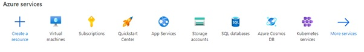

Pergi ke Virtual machines -> Create -> Azure virtual machine

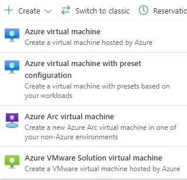

Setelah itu kamu isi

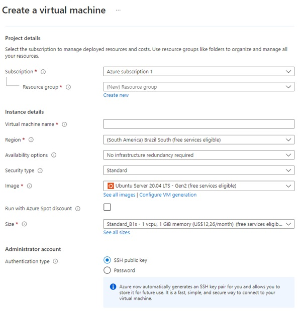

Untuk region kamu bebas cari yang mana, tapi untuk kali ini saya akan memilih US West 3
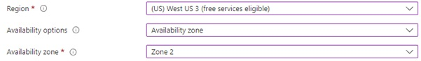

Untuk size VPS saya akan memakai F4s_v2 seharga $156 atau kamu bisa memilih yang lain
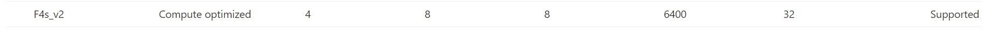
> harga bisa berbeda beda tergantung lokasi server yang kamu pilih

Untuk Administrator account saya sarankan untuk memilih SSH public key dikarenakan saya akan menggunakan ssh konek menggunakan putty
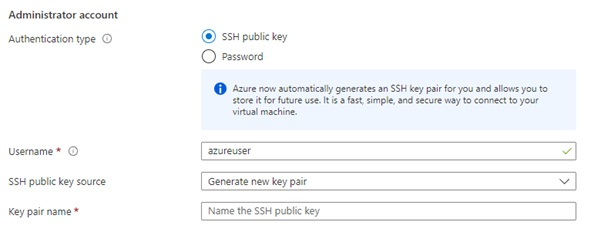

Setelah itu kamu tinggal klik Review + create dan klik create

Tunggu beberapa menit maka vps kamu sudah dibuat

Sebelum menyalakan vps kamu, kamu harus mensetting storage kamu

Pada halaman awal azure kamu, klik Virtual machine


Lalu pilih vps yang tadi kamu buat, klik menu overview lalu klik stop untuk mematikan vps
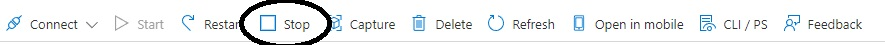

Setelah itu, klik menu Disk, lalu klik disk yang ada pada OS disk
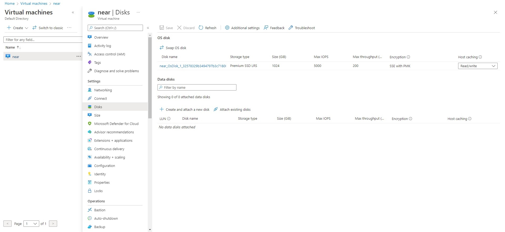

Kemudian, Klik Size + performance dan pilih 512 GiB dan performance tier di P30 dan klik Resize
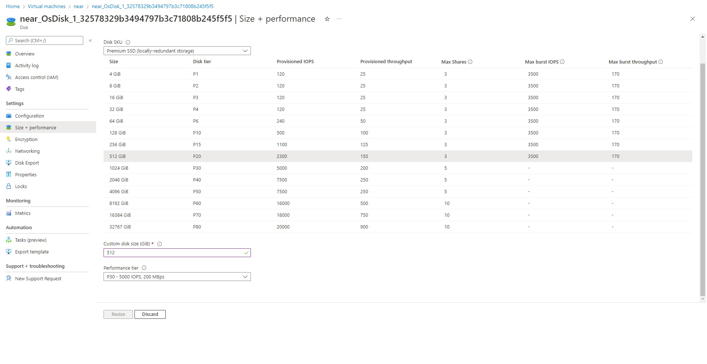

Setelah itu, tunggu beberapa saat. Setelah ada notifikasi berhasil maka nyalakan kembali vpsnya
Maka VPS sudah siap untuk di pakai untuk menjalankan node near


# STEP II Membuat akun wallet Near Shardnet
Kunjungi link ini https://wallet.shardnet.near.org/ dan buat akun dan simpan seed phrase. Wallet ini akan digunakan untuk menyimpan token NEAR.

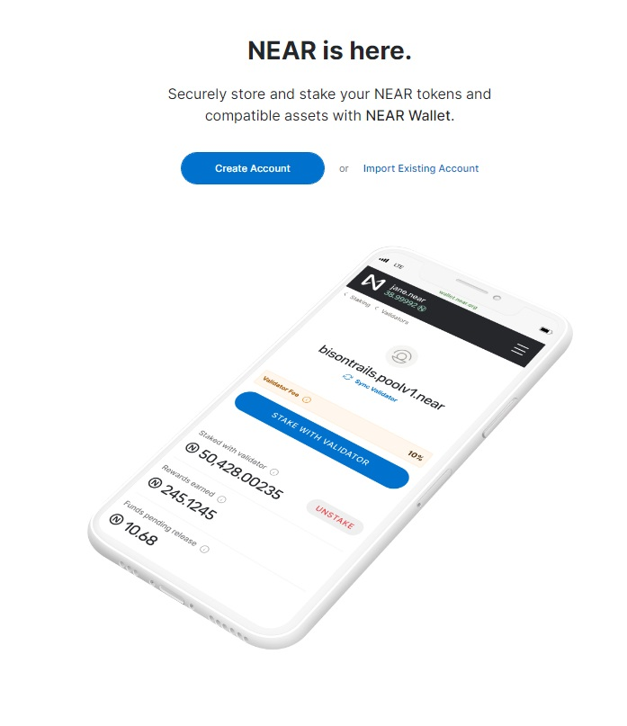

Nama wallet terserah kamu

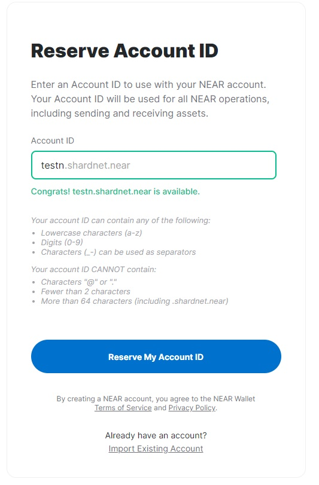

Pada saat membuat akun baru, kamu langsung akan mendapatkan 500 token NEAR

# STEP III Install Near CLI dan dev tools
Sebelum kita mulai, kita harus mengecek dahulu apakah cpu yang kita pakai sudah support avx

```
lscpu | grep -P '(?=.*avx )(?=.*sse4.2 )(?=.*cx16 )(?=.*popcnt )' > /dev/null \
  && echo "Supported" \
  || echo "Not supported"
```
> Apabila muncul kalimat supported maka kamu bisa lanjut ke step berikutnya

Pertama-tama, kita update dulu sistem yang kita pakai
```
sudo apt update && sudo apt upgrade -y
```

Install developer tools
```
sudo apt install -y git binutils-dev libcurl4-openssl-dev zlib1g-dev libdw-dev libiberty-dev cmake gcc g++ python3 docker.io protobuf-compiler libssl-dev pkg-config clang llvm cargo
```

Install Python pip
```
sudo apt install python3-pip
```
```
USER_BASE_BIN=$(python3 -m site --user-base)/bin
export PATH="$USER_BASE_BIN:$PATH"
```

Install Building env
```
sudo apt install clang build-essential make
```

Install Rust & Cargo
```
curl --proto '=https' --tlsv1.2 -sSf https://sh.rustup.rs | sh
```
Install Node.js & npm
```
curl -sL https://deb.nodesource.com/setup_18.x | sudo -E bash -  
sudo apt install build-essential nodejs
```
```
PATH="$PATH"
```

Source the environment
```
source $HOME/.cargo/env
```

Install Near CLI
```
sudo npm install -g near-cli
export NEAR_ENV=shardnet 
echo ‘export NEAR_ENV=shardnet’ >> ~/.bashrc
```


## Rust sudah berhasil di install, maka Langkah selanjutnya yaitu build nearcore

Pertama, Clone Repository
```
git clone https://github.com/near/nearcore
cd nearcore
git fetch
```

Checkout commit yang dibutuhkan. Mengacu pada [file ini](https://github.com/near/stakewars-iii/blob/main/commit.md). 
```
git checkout <commit>
```

Compile nearcore yang terbaru
```
cargo build -p neard --release --features shardnet
```
> Ini akan memakan waktu sekitar 15-20 menit tergantung spek vps yang digunakan

Agar dapat bekerja dengan baik, node NEAR memerlukan direktori kerja dan beberapa file konfigurasi. Hasilkan direktori kerja awal yang diperlukan dengan menjalankan:
```
./target/release/neard --home ~/.near init --chain-id shardnet --download-genesis
rm ~/.near/config.json
wget -O ~/.near/config.json https://s3-us-west-1.amazonaws.com/build.nearprotocol.com/nearcore-deploy/shardnet/config.json
```

Setelah selesai, kita bisa jalankan node
```
cd $home
cd nearcore
./target/release/neard --home ~/.near run
```
* Tunggu sampai node 100% sync, setelah itu kita akan membuat validator

Tulis command ini untuk login ke dalam akun near yang kita buat sebelumnya
```
near login
```
> Sebuah link akan keluar, copy dan buka di browser kamu, setelah itu izinkan akses penuh ke dalam akun kamu dengan memasukkan Account ID kamu
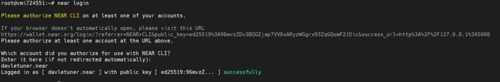

Sekarang kita akan membuat validator keys, keys tidak dibuat pada defaut maka dari itu kita akan membuatnya. Kita akan membuatnya dengan menggunakan Account ID kita dan mengubahnya menjadi bentuk yang valid
```
near generate-key <account_id> cp ~/.near-credentials/shardnet/<account_id>.json ~/.near/validator_key.json
```
> Di mana <account_id> adalah namawalletkamu.shardnet.near

Sekarang kita akan mengedit file validator_key.json
```
nano ~/.near/validator_key.json
```
* Edit “account_id” ke xx.factory.shardnet.near dimana xx adalah nama poolmu
* Edit “private_key” jadi “secret_key”

Contoh isi file
```
{
  "account_id": "xx.factory.shardnet.near",
  "public_key": "ed25519:HeaBJ3xLgvZacQWmEctTeUqyfSU4SDEnEwckWxd92W2G",
  "secret_key": "ed25519:****"
}
```

Buat sebuah file service
```
sudo tee /etc/systemd/system/neard.service > /dev/null <<EOF 
[Unit] 
Description=NEARd Daemon Service 

[Service] 
Type=simple 
User=$USER
#Group=near 
WorkingDirectory=$HOME/.near
ExecStart=$HOME/nearcore/target/release/neard run 
Restart=on-failure 
RestartSec=30 
KillSignal=SIGINT 
TimeoutStopSec=45 
KillMode=mixed 

[Install] 
WantedBy=multi-user.target 
EOF
```

Enable and start service
```
sudo systemctl daemon-reload 
sudo systemctl enable neard 
sudo systemctl start neard
```

Jika ingin melihat logs dengan warna
```
sudo apt install ccze
```

Cek log
```
journalctl -n 100 -f -u neard | ccze -A
```

# Step IV - Deploy sebuah staking pool untuk validator
Deploy a staking pool contract
```
near call factory.shardnet.near create_staking_pool '{"staking_pool_id": "<pool id>", "owner_id": "<accountId>", "stake_public_key": "<public key>", "reward_fee_fraction": {"numerator": 5, "denominator": 100}, "code_hash":"DD428g9eqLL8fWUxv8QSpVFzyHi1Qd16P8ephYCTmMSZ"}' --accountId="<accountId>" --amount=30 --gas=30000000000000
```
* Pool ID: Staking pool name, contohnya jika pool idnya flamekaisar maka akan dibuat flamekaisar.factory.shardnet.near
* Owner ID: akun Near Shardnet yang akan mengelola staking pool
* Public Key: Public key yang ada di file validator_key.json
* 5: fee yang dikenakan di pool (dalam kasus ini berrarti 5% fee)
* Account Id: biasanya sama dengan Owner ID
* Ganti parameter “pool id”,  "accountId" , "public key"
> Pastikan di wallet ada sekitar 30 NEAR

Contoh
```
near call factory.shardnet.near create_staking_pool '{"staking_pool_id": "flamekaisar", "owner_id": "flamekaisar.shardnet.near", "stake_public_key": "ed25519:5e36d4QTevkbBeqtadoEe72et8T158vAispktd6hdgr", "reward_fee_fraction": {"numerator": 5, "denominator": 100}, "code_hash":"DD428g9eqLL8fWUxv8QSpVFzyHi1Qd16P8ephYCTmMSZ"}' --accountId="flamekaisar.shardnet.near" --amount=30 --gas=30000000000000
```

Sekarang poolmu sudah terlihat di https://explorer.shardnet.near.org/nodes/validators

Langkah selanjutnya adalah stake ke pool
```
near call <staking_pool_id> deposit_and_stake --amount <amount> --accountId <accountId> --gas=30000000000000
```

Contoh dengan stake 110 near
```
near call flamekaisar.factory.shardnet.near deposit_and_stake --amount 110 --accountId flamekaisar.shardnet.near --gas=30000000000000
```

# Step V - Set up tools for monitoring node status
File log disimpan baik di direktori ~/.nearup/logs atau di systemd

Command
```
sudo apt install curl jq
```

Cek versi node
```
curl -s http://127.0.0.1:3030/status | jq .version
```

Cek delegator dan stake
```
near view <your pool>.factory.shardnet.near get_accounts '{"from_index": 0, "limit": 10}' --accountId <accountId>.shardnet.near
```

Cek alasan validator kicked
```
curl -s -d '{"jsonrpc": "2.0", "method": "validators", "id": "dontcare", "params": [null]}' -H 'Content-Type: application/json' 127.0.0.1:3030 | jq -c '.result.prev_epoch_kickout[] | select(.account_id | contains ("<POOL_ID>"))' | jq .reason
```

Cek Blocks Produced / Expected
```
curl -s -d '{"jsonrpc": "2.0", "method": "validators", "id": "dontcare", "params": [null]}' -H 'Content-Type: application/json' 127.0.0.1:3030 | jq -c '.result.current_validators[] | select(.account_id | contains ("POOL_ID"))'
```

Dengan ini, kamu sudah sukses menjalankan validator node kamu sediri
Maka Challenge 1-4 sudah selesai

Selamat :partying_face::partying_face::partying_face:

Untuk Challenge yang lain dapat dilihat di
https://github.com/near/stakewars-iii/tree/main/challenges


